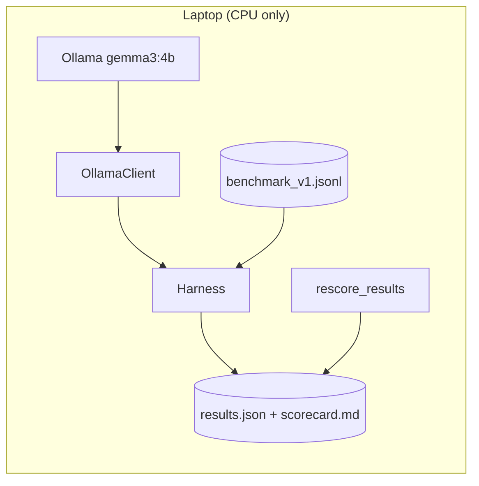

# TODO-230826 — Execution Roadmap (Gemma4-CyberAi)

> **Authoritative short-to-medium-term roadmap.** Audit date: 2026-08-23.
> Companion to [`PROJECT_PLAN.md`](../PROJECT_PLAN.md) (strategy) — this file is the *next-actions* layer.
> Every claim here was verified against the repository, git history, tests, and a live baseline run. Tags: **[VERIFIED]** = checked this session · **[REC]** = recommendation · **[ASSUMPTION]** · **[OPEN]** = needs a decision/investigation.

---

## Project Status

- **Repo:** `Gemma4-CyberAi`, private GitHub (`NovrusShehaj/Gemma4-CyberAi`), branch `main`, clean tree, in sync with `origin`. **[VERIFIED]**
- **Milestone 1 complete:** deterministic Ollama client + frozen `benchmark_v1` (25 items) + baseline harness + baseline recorded. **[VERIFIED]**
- **Tests:** 19/19 passing (`pytest`). **[VERIFIED]**
- **Baseline:** `gemma3:4b` → pass_rate **0.84**, mean_score **0.813** (n=25, temp=0, seed=0, 1082s CPU). **[VERIFIED]**
- **No training has occurred.** No models/checkpoints/adapters/datasets beyond the benchmark. No CI, Docker, `.env`, or ML training deps installed. **[VERIFIED]**

---

## Executive Summary

The project has a **solid, reproducible evaluation foundation and an honest baseline** — which is exactly the right first thing to have built, and better discipline than most 4B-specialization attempts. What exists is small but correct: a clean client/harness/scorer stack with tests, a frozen original benchmark, and a trustworthy baseline number.

The **single biggest limitation** is that the measurement instrument is **too small to be trustworthy for detecting improvement**: 25 items across 14 categories means most categories have **n=1–4**, so a post-training delta would be statistical noise. Before any money is spent on cloud fine-tuning, the benchmark must become a real instrument.

Three **decisions are still unanswered** and block the training track: base model (gemma3 vs Gemma 4), cloud GPU budget, and project intent (personal vs distributed). Local fine-tuning is **impossible on this hardware** (no CUDA GPU, 15 GiB RAM), so training will be cloud-based — which makes a trustworthy benchmark and a licensed dataset the prerequisites that gate everything.

**The next milestone is therefore NOT training.** It is **Benchmark v2** — expand and harden the evaluation instrument and pre-register success criteria — because the project's core thesis ("did specialization measurably help?") is unanswerable until the benchmark can measure it.

---

## Current Maturity Level

**Level 2 — Working MVP** (specifically: a working, reproducible *evaluation/baseline* MVP).

Justification (evidence-based, deliberately not inflated):

| Level                    | Met? | Evidence                                                                              |
|--------------------------|------|---------------------------------------------------------------------------------------|
| 0 Concept                |  ✅  | PROJECT_PLAN.md                                                                       |
| 1 Prototype              |  ✅  | Working client + harness, runs end-to-end                                             |
| 2 Working MVP            |  ✅  | Reproducible baseline, 19 passing tests, deterministic, versioned benchmark           |
| 3 Experimental ML system |  ❌  | **No training pipeline exists or has run.** No dataset, no experiment beyond baseline |
| 4 Production candidate   |  ❌  | No CI, no deployment, no serving API, no monitoring, no model versioning              |
| 5 Production-ready       |  ❌  | —                                                                                     |

> A passing baseline harness is **not** a trained model, and a 25-item benchmark is **not** production evaluation. The project is a well-built starting line, not a specialized model.

---

## Repository Audit

Verified file inventory (excl. `.venv`, `.git`, caches):

```
PROJECT_PLAN.md              # strategy (updated: milestone-1 status line)
README.md, DATA_LICENSES.md  # docs + data-licensing policy
docs/decisions.md            # decision log (incl. scorer-bug fix + baseline finding)
pyproject.toml, .gitignore   # uv, py3.11-3.12, milestone-1 deps only
src/gemma_cyber/
  clients/ollama_client.py   # deterministic Ollama HTTP client (inference only)
  evaluation/schema.py       # pydantic BenchmarkItem + JSONL loader
  evaluation/scorers.py      # mcq / keyword / insufficient_evidence / hallucination
  evaluation/harness.py      # run_benchmark + rescore_results -> results.json + scorecard.md
scripts/                     # run_baseline.py, chat.py, rescore.py
data/evaluation/benchmark_v1.jsonl   # 25 FROZEN original items
experiments/baseline_gemma3-4b/      # results.json + scorecard.md
tests/                       # 19 tests (schema, scorers, harness[stub], client[live-skip])
```

Planned-vs-actual (from `PROJECT_PLAN.md`):

| Component | Planned | Status | Notes |
|---|---|---|---|
| Ollama client | ✅ | **Implemented** | Deterministic, tested |
| Benchmark + harness | ✅ | **Implemented (small)** | 25 items; needs expansion |
| Baseline eval | ✅ | **Implemented** | 0.84 pass; rescored |
| Dataset schema/pipeline | ✅ | **Missing** | Only eval schema exists; no *training* dataset schema/validators |
| Contamination check | ✅ | **Missing** | Referenced in plan/DATA_LICENSES; not built |
| LLM-judge scorer | ✅ (§17) | **Deferred** | Deterministic scorers only (documented) |
| Training pipeline (cloud QLoRA) | ✅ | **Missing** | Not started (correctly deferred) |
| RAG / vector DB | future | **Missing** | Correctly not built |
| Agent / tools | future | **Missing** | Correctly not built |
| CI/CD, Docker, model registry | future | **Missing** | Not yet justified |

**No unexplained divergence from the plan.** The one intentional deviation (src-layout package `gemma_cyber/`; deterministic-only scorers) is recorded in `docs/decisions.md`. The plan remains accurate; this TODO refines *sequence*, not architecture.

---

## Completed Work

- [x] Reproducible Python env (`uv`, Python 3.12; system 3.14 avoided). **[VERIFIED]**
- [x] Deterministic Ollama client (temp=0/seed=0, records model tag). **[VERIFIED]**
- [x] Benchmark schema + JSONL loader with duplicate-id and license/provenance enforcement. **[VERIFIED]**
- [x] Four deterministic scorers incl. hallucination + insufficient-evidence traps. **[VERIFIED]**
- [x] Harness → `results.json` + `scorecard.md`; `rescore_results` (re-score without re-inference). **[VERIFIED]**
- [x] Frozen `benchmark_v1` (25 original items; no HTB/THM). **[VERIFIED]**
- [x] Baseline recorded + MCQ-extractor bug found and fixed (case-insensitive prose match). **[VERIFIED]**
- [x] 19 tests; private GitHub repo; 5 clean commits; secrets scanned pre-push. **[VERIFIED]**

---

## Incomplete Work

- [x] ~~Benchmark too small for reliable per-category signal~~ — Benchmark v2: 112 items, ≥6/category.
- [x] ~~No pre-registered success/improvement criteria~~ — `configs/eval_success_criteria.md`.
- [x] ~~No held-out test split~~ — dev/test split (67/45) frozen in v2 data.
- [x] ~~No contamination checker~~ — `src/gemma_cyber/data/contamination.py` + CLI + tests.
- [ ] No training-dataset schema, validators, or builder. *(P1 — for TRAINING data; separate from the eval schema.)*
- [ ] No cloud training scaffold (QLoRA notebook/script).
- [ ] No LLM-judge scorer (keyword proxy causes false negatives — see Known Problems).
- [ ] No CI to keep tests green on push.

---

## Known Problems

| # | Problem | Evidence | Severity | Action |
|---|---|---|---|---|
| K1 | Benchmark statistically underpowered | 14 categories over 25 items (n=1–4 each) | **High** | NEXT MILESTONE (Benchmark v2) |
| K2 | Keyword scorer produces false negatives | `log-0003`, `det-0001` failed despite reasonable answers (keyword-proxy miss) | Medium | P1: add LLM-judge scorer |
| K3 | Base model fails hallucination traps | `halluc-0001/0002` = 0.0 (engages fake CVE/tool) | Medium (this is a *finding*, not a defect) | Drives dataset design |
| K4 | No held-out test set | single frozen set | Medium | Fold into Benchmark v2 (dev/test split) |
| K5 | Success criteria not pre-registered | absent | Medium | Fold into Benchmark v2 |

> K3 is the **most valuable finding**: it's a concrete, measurable weakness that specialization (SFT for uncertainty behavior + later RAG for facts) can target.

---

## Technical Debt

| ID | Debt | Severity | Impact | Fix | Blocks prod? | Timing |
|---|---|---|---|---|---|---|
| D1 | Deterministic scorers only (keyword brittleness) | Med | False negatives skew scores | LLM-judge scorer behind same interface | No | P1 (before training comparison) |
| D2 | No CI | Med | Regressions slip in | GitHub Actions: `pytest` on push | No | P1 |
| D3 | No linting/type-checking config | Low | Style drift | Add `ruff` + `mypy` (dev-only) | No | P2 |
| D4 | Live client test depends on Ollama (auto-skips) | Low | Coverage gaps in CI | Mock in CI; keep live test local | No | P2 |
| D5 | Experiment tracking = files only | Low | OK now; scales poorly | Revisit W&B/MLflow when exp count grows | No | P3 |
| D6 | No `requirements`/lockfile pinned for reproducibility | Low | Env drift | `uv lock` / pin versions | Partial | P2 |

Do **not** fix all of this now. D1 and D2 matter before the first training comparison; the rest can wait.

---

## Current Architecture


Inference-only, deterministic, file-based outputs. No training, RAG, tools, API, or monitoring — all correctly deferred.

---

## Model Status

- **In use:** `gemma3:4b` via Ollama (GGUF, ~Q4, 3.3 GB), CPU inference. **[VERIFIED]**
- **Inference/training separation:** clean — client is inference-only; training deps deliberately absent. **[VERIFIED]**
- **Benchmarked:** yes (baseline). **Fine-tuned:** no. **Checkpoints:** none. **Quantization (training):** N/A yet.
- **[REC]** `gemma3:4b` remains a sensible MVP base (small, 128K context, well-supported FT path). Keep it — but **baseline Gemma 4 and `qwen2.5-coder:7b` as reference ceilings** during Benchmark v2 (both already relevant; qwen is already pulled locally). Switching base is a **future decision (OPEN Q1)**, not a now-rewrite.

---

## Training Status

**Not started (correctly).** Local training is **infeasible** (no CUDA GPU, 15 GiB RAM — verified prior session). Path forward is **cloud QLoRA** (TRL+PEFT+bitsandbytes), gated on **OPEN Q2 (GPU budget)**.

Concrete next training sequence (do **not** collapse to "fine-tune the model"):

```text
[now] Baseline (done)
  -> Benchmark v2 (trustworthy instrument + pre-registered bar)   <-- NEXT MILESTONE
  -> Training-dataset schema + validators + contamination check
  -> Author small SFT dataset (few hundred rows, reasoning-focused)
  -> Cloud QLoRA exp-001 (single GPU, ephemeral)
  -> Merge -> GGUF -> Ollama import (gemma3-cyber:v0.1)
  -> Evaluate vs baseline on Benchmark v2 (held-out test)
  -> Failure analysis -> dataset iteration -> exp-002
  -> Regression check (no category regressions)
```

---

## Dataset Status

- **Exists:** only `data/evaluation/benchmark_v1.jsonl` (25 original items, CC-BY-4.0, no third-party content). **[VERIFIED]**
- **Training data:** none. **Train/eval separation:** enforced by policy (`DATA_LICENSES.md`) and `.gitignore` (`data/raw|processed|quarantine` ignored), but **no contamination checker exists yet**.
- **Provenance/licensing:** schema requires `license` + `provenance`; validator rejects rows lacking them. **[VERIFIED]**
- **HTB/THM:** correctly excluded (policy in place).

---

## Evaluation Status

- **Instrument:** works and is reproducible, but **underpowered** (K1) and **keyword-brittle** (K2).
- **Composition (verified):** domains blue_team 11 / offensive_ctf 9 / general 5; scorers mcq 13 / keyword 8 / insufficient 2 / hallucination 2; difficulty intro 3 / intermediate 17 / advanced 5.
- **Success measured by:** pass_rate + mean_score, per-category + overall; regression detectable via same harness on any model. **Not** loss-based. ✅

---

## Immediate Next Milestone

### 🎯 NEXT MILESTONE — Benchmark v2: a trustworthy, pre-registered evaluation instrument

**Objective.** Turn the 25-item proof-of-concept into a benchmark that can *reliably detect* whether specialization helped, and commit the success criteria **before** any training.

**Why it is next (single, non-competing).** The project's entire thesis is "can we *measurably* improve gemma3:4b?" With n=1–4 per category, a post-training delta is indistinguishable from noise, and cloud-training spend (OPEN Q2) would be uninterpretable. This milestone is fully **unblocked** (no GPU, no budget decision, no unanswered question required) and everything downstream depends on it.

**Prerequisites.** None (Ollama + harness already work).

**Files involved.**
- `data/evaluation/benchmark_v1.jsonl` — keep frozen (do not edit; provenance).
- `data/evaluation/benchmark_v2.jsonl` — **new**, ≥100 items (target ~120).
- `data/evaluation/README.md` — **new**, documents split + freeze policy.
- `configs/eval_success_criteria.md` — **new**, the pre-registered bar.
- `src/gemma_cyber/data/contamination.py` — **new**, train↔eval overlap check (exact + fuzzy).
- `src/gemma_cyber/evaluation/schema.py` — add optional `split` field (`dev`/`test`).
- `tests/test_contamination.py`, extend `tests/test_schema.py`.

**Implementation steps.**
1. Expand to **≥100 original items**, **≥6 per category**, balanced across blue/offensive/general; add depth to thin categories (AD, incident_response, detection_engineering, evidence_interpretation).
2. **Increase discriminating traps**: ≥6 hallucination + ≥6 insufficient-evidence items (these separate a specialized model from the base).
3. Add a **`split` field** and freeze a **held-out `test`** set (~40%) plus a **`dev`** set (~60%) for iteration, to prevent benchmark overfitting.
4. Write **`configs/eval_success_criteria.md`**: pre-register the bar, e.g. *"+X pp overall pass_rate on `test`, ≥+Y pp on hallucination category, and **zero** category regression vs baseline."* (Choose X/Y from the re-run baseline.)
5. Build **contamination checker** (normalized exact-match + n-gram/Jaccard fuzzy) and a `scripts/check_contamination.py` CLI; wire a unit test.
6. Re-run baseline on `benchmark_v2` (`dev` + `test`) → `experiments/baseline_gemma3-4b_v2/`.
7. Update `docs/decisions.md`, `PROJECT_PLAN.md` status, and this TODO.

**Tests.** `pytest` green; schema validates v2 (unique ids, license/provenance present, split ∈ {dev,test}); contamination checker unit-tested on known overlap/non-overlap pairs.

**Acceptance criteria.** ✅ **COMPLETE (2026-08-24)** — evaluation infra only, no training.
- [x] `benchmark_v2.jsonl` **112 items**, ≥6/category (16 cats), all original + CC-BY-4.0, no HTB/THM.
- [x] dev/test split committed (67/45, ~40% test, stratified, frozen in data); test documented as held-out in `data/evaluation/README.md`.
- [x] `configs/eval_success_criteria.md` committed with concrete numeric thresholds derived from the fresh v2 baseline.
- [x] contamination checker implemented (`src/gemma_cyber/data/contamination.py`) + tested (`tests/test_contamination.py`) + CLI (`scripts/check_contamination.py`).
- [x] fresh v2 baseline committed under `experiments/baseline_gemma3-4b_v2/{dev,test}/` (test 0.933 / dev 0.836; hallucination 0.000).
- [x] all tests pass (44); changes committed on branch `benchmark-v2`.

**Definition of done.** A future session can run one command to (a) validate no train/eval overlap and (b) produce a v2 baseline scorecard, and there is a committed, numeric bar that a fine-tuned model must beat on a held-out test set.

---

## P0 Tasks — Blocking

| ID | Task | Why | Deps | Acceptance | Complexity | Risk |
|---|---|---|---|---|---|---|
| P0-1 | **Answer OPEN Q1/Q2/Q3** (base model; cloud GPU budget; personal vs distributed) | Gate the entire training track & licensing obligations | — | Decisions recorded in `docs/decisions.md` | Low (user decision) | Wrong call wastes cloud spend |
| P0-2 | ✅ **Benchmark v2** (DONE 2026-08-24) | Instrument must be trustworthy before training | — | Met — see milestone acceptance | Medium | Authoring effort/time |

## P1 Tasks — Critical

| ID | Task | Why | Deps | Acceptance | Complexity | Risk |
|---|---|---|---|---|---|---|
| P1-1 | LLM-judge scorer (behind existing scorer interface) | Fix keyword false-negatives (K2) before comparisons | P0-2 | Judge scorer + judge–human calibration on ~20 items ≥80% agreement | Medium | Judge unreliability |
| P1-2 | Training-dataset schema + validators | Input to fine-tuning; enforce license/provenance | P0-2 | pydantic schema + validator + tests; rejects unlicensed rows | Medium | Scope creep |
| P1-3 | Author SFT dataset v0.1 (few hundred rows, reasoning-focused, hallucination/uncertainty emphasis) | Targets K3 weakness | P1-2 | versioned JSONL, contamination-clean vs v2 test | High | Data quality/bias |
| P1-4 | Cloud QLoRA scaffold (Colab/RunPod script/notebook) | Enable exp-001 the moment Q2 is settled | P0-1(Q2) | runs on a rented GPU; produces adapter + GGUF | Medium | Env/template mismatch |
| P1-5 | GitHub Actions CI (`pytest`) | Prevent regressions (D2) | — | CI green on push | Low | — |

## P2 Tasks — Important

| ID | Task | Why | Deps | Acceptance | Complexity |
|---|---|---|---|---|---|
| P2-1 | exp-001: run first QLoRA, import to Ollama, eval vs baseline on v2 test | First real answer to the thesis | P1-3,P1-4,P0-2 | comparison scorecard + written verdict | Medium |
| P2-2 | `ruff` + `mypy` dev config (D3) | Maintainability | — | lint/type clean in CI | Low |
| P2-3 | Reference-ceiling baselines (Gemma 4, qwen2.5-coder:7b) on v2 | Know if ceiling is model or method | P0-2 | scorecards committed | Low |
| P2-4 | Pin dependencies / `uv lock` (D6) | Reproducibility | — | lockfile committed | Low |

## P3 Tasks — Future (do NOT build yet)

| ID | Task | Gate |
|---|---|---|
| P3-1 | RAG + local vector DB | Only if v2 failure analysis shows *knowledge-shaped* errors |
| P3-2 | DPO / preference optimization | Only if SFT plateaus with good data |
| P3-3 | Sandboxed read-only tool layer | Only after model shows useful task performance |
| P3-4 | Controlled agent + guardrails (§24 safety) | Gated on all of the above + safety review |
| P3-5 | Serving API / model registry / monitoring | Only near a production candidate |

---

## Model Training Roadmap

| Stage | State | Notes |
|---|---|---|
| 1 Base model `gemma3:4b` | ✅ done | via Ollama |
| 2 Baseline evaluation | ✅ done (v1) | re-do on v2 |
| 3 Dataset development | ⏳ next (P1-2/P1-3) | reasoning-focused; hallucination/uncertainty first |
| 4 First QLoRA experiment | ⛔ blocked on Q2 + dataset | cloud only |
| 5 Evaluation vs base | ⛔ | same harness, v2 held-out test |
| 6 Failure analysis | ⛔ | per-category + regression |
| 7 Dataset iteration | ⛔ | change ONE variable |
| 8 Second experiment | ⛔ | measure improvement |
| 9 Tool augmentation | ⛔ future | externalize volatile facts |
| 10 Controlled agent | ⛔ future | safety-gated |

**Train into weights vs keep external (design rule):**
- **Train (SFT):** output format, evidence-based reasoning *style*, uncertainty/"insufficient-evidence" behavior, refusing fabricated artifacts. (Behavior, not facts.)
- **RAG (later):** current CVEs, exact tool flags, ATT&CK IDs, Sigma fields — volatile/precise facts a 4B will hallucinate.
- **Tools (later):** live system state, parsing real scan/log output.
- **Sandboxed agent (later):** lab interaction, command execution — guardrailed.

---

## Dataset Roadmap

1. **Schema + validators** (P1-2): canonical fields (id, task_type, domain, difficulty, context, evidence, question, expected_approach, final_answer, remediation, attack_mapping, safety, source, provenance, license, dataset_version); training-text vs metadata split per PROJECT_PLAN.md §15.1.
2. **Contamination control** (in NEXT MILESTONE): automated train↔eval overlap gate; fail build on hit.
3. **SFT v0.1** (P1-3): few hundred **original** rows; emphasize reasoning + uncertainty; cover blue-team (log/IR/detection/ATT&CK/Sigma/YARA/IOC/network/vuln/hardening) and authorized offensive/CTF (recon/enum/web/linux/windows/AD/privesc/exploit-*reasoning*/tool-selection/methodology).
4. **Provenance/licensing**: keep `DATA_LICENSES.md` current; quarantine uncertain sources; **no HTB/THM scraping** (ToS/copyright + contamination risk).
5. **Iterate** from failure analysis, not intuition.

---

## Evaluation Roadmap

1. Benchmark v2 (size + traps + dev/test split + pre-registered bar) — NEXT MILESTONE.
2. LLM-judge scorer (P1-1) with human calibration to reduce proxy error.
3. Reference-ceiling baselines (P2-3).
4. Regression harness: every experiment re-runs the full test set; flag any category regression (catastrophic-forgetting guard).
5. Report: overall + per-category pass_rate/mean_score, hallucination rate, insufficient-evidence recognition, regression rate.

---

## Production Readiness Roadmap

Production-ready ≠ "the model answers." For this project it means the full chain below holds. **Current status is early; most items are future.**

- **Model quality:** benchmarking ✅(small) → v2 ⏳ → regression suite ⏳ → hallucination metric ✅(exists) → documented capability boundaries ⏳.
- **Data:** provenance ✅policy → versioning ⏳ → validation ⏳ → leakage prevention ⏳(checker) → quality review ⏳.
- **Training:** reproducibility ⏳(seeds/manifest planned) → experiment tracking (files) → model versioning (Ollama tags) → checkpoint mgmt ⏳ → rollback ⏳.
- **Software eng:** tests ✅ → CI ⛔ → lint/type ⛔ → dep pinning ⛔ → config mgmt ⏳.
- **Deployment:** serving (Ollama local) → API ⛔ → authn/z ⛔ → rate limiting ⛔ → resource mgmt ⛔.
- **Security (dual-use):** sandboxing ⛔ → prompt-injection defense ⛔ → tool/credential isolation ⛔ → audit logging ⛔ → network controls/allowlists ⛔ → human approval ⛔. (All required *before* any tool/agent phase.)
- **Observability:** logs/metrics/traces/error tracking/usage ⛔ (introduce with an API).
- **Reliability:** timeouts ✅(client) → retries ⛔ → fallback ⛔ → health checks ⛔.
- **Operations:** backups/DR/model+dataset rollback/incident response ⛔.
- **Documentation:** README ✅, plan ✅, decisions ✅ → model cards ⛔ → dataset cards ⏳ → runbooks ⛔.

**Architecture evolution:** Current eval MVP → reliable dev env (CI, pinned deps) → validated ML pipeline (dataset schema + contamination) → reproducible cloud training → benchmark+regression system → (only if justified) tools → sandboxed agent → service/API → observability+security → production candidate.

---

## Security and Safety Roadmap

- **Scope now:** education, CTFs, HTB/THM-style *authorized* labs, defensive security, owned/authorized systems only. No autonomous action against arbitrary targets. (Consistent with PROJECT_PLAN.md §24.)
- **Data safety:** no scraped proprietary content; license/provenance enforced; secrets excluded via `.gitignore` (verified none committed).
- **Before ANY tool/agent phase (P3-3+), all mandatory:** target allowlist (default-deny), sandboxed + network-isolated execution, human approval for state-changing/offensive actions, command logging + immutable audit trail, credential isolation, rate limits, disposable environments, kill switch. Treat all tool/retrieved output as **untrusted** (prompt-injection defense).
- **Model derivative:** any fine-tune remains "a Gemma" under the Gemma Terms + Prohibited Use Policy (flows downstream on distribution).

---

## Infrastructure Roadmap

Only what the roadmap justifies:

| Infra | When | Justification |
|---|---|---|
| GitHub Actions CI (pytest) | P1 | Keep tests green (D2) |
| Cloud GPU (rented, ephemeral) | P1/P2 | Only place training can run |
| Dependency lockfile | P2 | Reproducibility |
| lint/type tooling | P2 | Maintainability |
| Experiment manifests (files) | P2 | Already sufficient; W&B/MLflow only if exp count grows (P3) |
| Model registry / artifact storage | P3 | Near production candidate |
| Serving API + secrets mgmt + monitoring | P3 | Only when serving beyond local |
| Containerization (Docker/Podman) | P3 | For the eventual sandbox/agent |

Not yet justified: Kubernetes, vector DB, multi-agent infra, message queues.

---

## Technical Risk Register

| ID | Risk | Prob | Impact | Sev | Status | Early warning | Mitigation | Contingency |
|---|---|---|---|---|---|---|---|---|
| R1 | 4B too weak to clear a useful bar | M-H | H | **High** | open | baseline plateaus; SFT marginal | niche on blue-team/methodology; ref-ceiling baselines | reframe scope or switch base (Q1) |
| R2 | Underpowered benchmark → noisy verdicts | H | H | **High** | **active** | n=1–4/category | Benchmark v2 (NEXT MILESTONE) | expand further; bootstrap CIs |
| R3 | Dataset licensing violation (HTB/THM) | M | H | **High** | mitigated (policy) | unlicensed rows | enforce license field; no scraping | purge; legal review (Q3) |
| R4 | Eval contamination inflates results | M | H | **High** | open | suspicious gains | contamination checker + dev/test split | rebuild test set |
| R5 | No cloud GPU budget | M | H | **High** | open (Q2) | can't run exp-001 | free Colab/Kaggle first | stop at prompt+RAG |
| R6 | Keyword scorer false negatives | H | M | Med | **active** | reasonable answers scored 0 | LLM-judge (P1-1) | manual scoring |
| R7 | Fine-tuning yields no gain | M | M | Med | open | tuned≈base | verify chat template; data quality; RAG | accept negative result |
| R8 | Catastrophic forgetting/overfitting | M | M | Med | open | regression rate up | fewer epochs/lower LR/mixed data | roll back adapter |
| R9 | GGUF/Ollama import friction | M | M | Med | open | tuned model won't import | test llama.cpp path early | serve via llama.cpp temporarily |
| R10 | Prompt injection via evidence/tool output | M (future) | H | Med | design | model follows embedded instructions | untrusted-input handling; sandbox | disable tool; audit |
| R11 | Over-engineering ahead of evidence | M | M | Med | controlled | building RAG/agents early | phase gates in this TODO | freeze scope to milestone |
| R12 | Quantization quality loss (Q4 GGUF) | M | L-M | Low | open | eval delta vs fp | record quant; compare on subset | ship higher-precision GGUF |

---

## Next Three Development Phases

### Phase A — Trustworthy Evaluation (this milestone + judge)
- **Goal:** an instrument that can reliably detect improvement.
- **Tasks:** Benchmark v2 (P0-2), LLM-judge (P1-1), CI (P1-5), fresh v2 baseline.
- **Deliverables:** `benchmark_v2` (dev/test), `eval_success_criteria.md`, contamination checker, judge scorer, CI.
- **Evaluation criteria:** ≥100 items/≥6 per category; judge–human agreement ≥80%; CI green.
- **Exit:** committed numeric bar + reproducible v2 baseline.

### Phase B — Dataset + First Training Experiment
- **Goal:** answer the thesis once.
- **Tasks:** dataset schema/validators (P1-2), SFT v0.1 (P1-3), cloud QLoRA scaffold (P1-4), exp-001 (P2-1).
- **Deliverables:** versioned SFT dataset, adapter + GGUF, `gemma3-cyber:v0.1`, comparison scorecard + verdict.
- **Evaluation criteria:** tuned vs baseline on v2 **test**; meets/【misses】pre-registered bar; no category regression.
- **Exit:** honest positive/negative verdict recorded.

### Phase C — Iterate or Pivot (evidence-driven)
- **Goal:** act on Phase B results.
- **Tasks:** failure analysis → dataset iteration → exp-002 (positive path); OR RAG spike if failures are knowledge-shaped; OR base-model reconsideration (Q1).
- **Deliverables:** exp-002 scorecard or RAG feasibility note.
- **Exit:** clear decision on whether SFT is the right lever at 4B.

---

## Definition of Done

| Target | Done when… |
|---|---|
| **Next milestone (Benchmark v2)** | ≥100 items, dev/test split, pre-registered numeric bar committed, contamination checker tested, v2 baseline committed, tests pass, pushed |
| **MVP** | Benchmark v2 + one QLoRA experiment + honest verdict vs pre-registered bar (per PROJECT_PLAN.md §29) |
| **First successful fine-tuning experiment** | exp-001 beats the pre-registered bar on v2 **test** with **zero** category regression, reproducible from its manifest |
| **Cybersecurity-specialized model** | Sustained, statistically meaningful gains across multiple categories over ≥2 iterations; documented capability boundaries; model card |
| **Controlled agent** | All §24 guardrails implemented + tested; operates only in disposable owned labs; no path to external targets |
| **Production candidate** | CI + pinned deps + regression suite + serving API + authn/z + audit logging + monitoring + runbooks |
| **Production-ready** | Above sustained under load, with DR/rollback (model+dataset), incident response, and passing security review |

---

## Recommended Next Claude Code Session

```text
Read:
- PROJECT_PLAN.md
- .claude/TODO-230826.md

Then execute the NEXT MILESTONE (Benchmark v2):

1. Inspect the repo; run `pytest` and confirm 19+ tests pass; confirm Ollama + gemma3:4b reachable.
2. Verify assumptions in this TODO still hold (git clean, no new files, baseline present).
3. Add optional `split` field to the benchmark schema (dev|test); keep benchmark_v1.jsonl frozen.
4. Author data/evaluation/benchmark_v2.jsonl: >=100 ORIGINAL items, >=6 per category,
   balanced blue/offensive/general, with >=6 hallucination and >=6 insufficient-evidence traps.
   No HTB/THM content. Every row carries license + provenance.
5. Assign dev/test split (~60/40); document freeze policy in data/evaluation/README.md.
6. Write configs/eval_success_criteria.md with concrete numeric thresholds (pick from the re-run baseline).
7. Implement src/gemma_cyber/data/contamination.py (exact + fuzzy overlap) + scripts/check_contamination.py + tests.
8. Re-run baseline on benchmark_v2 -> experiments/baseline_gemma3-4b_v2/ (expect a long CPU run; can background).
9. Run `pytest` (all green). Update docs/decisions.md, PROJECT_PLAN.md status, and this TODO's checkboxes.
10. Commit in logical groups; scan staged files for secrets; push to origin.

Do NOT: fine-tune, build RAG/agents/tools/API, install training deps, or edit benchmark_v1.
If OPEN Q1/Q2/Q3 are unanswered, proceed with Benchmark v2 anyway (it is unblocked) and flag the decisions.
```

Start a new session with: **"Read PROJECT_PLAN.md and .claude/TODO-230826.md and execute the next milestone."**

---

## Final Recommendations

1. **Do the measurement before the modeling.** Benchmark v2 is worth more than a rushed fine-tune; a noisy benchmark makes cloud spend uninterpretable.
2. **Answer Q1/Q2/Q3 soon** — they're cheap decisions that unblock the entire training track.
3. **Target the hallucination weakness first** — it's the clearest, most measurable win for a 4B and plays to what SFT does well (behavior, not facts).
4. **Keep resisting over-engineering.** No RAG/agents/API until an experiment demands them. The phase gates here exist to enforce that.
5. **Stay honest about the ceiling.** A realistic best outcome for 4B is a strong blue-team/CTF-*methodology* assistant, not an autonomous solver — plan and message accordingly.
