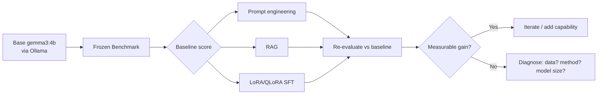
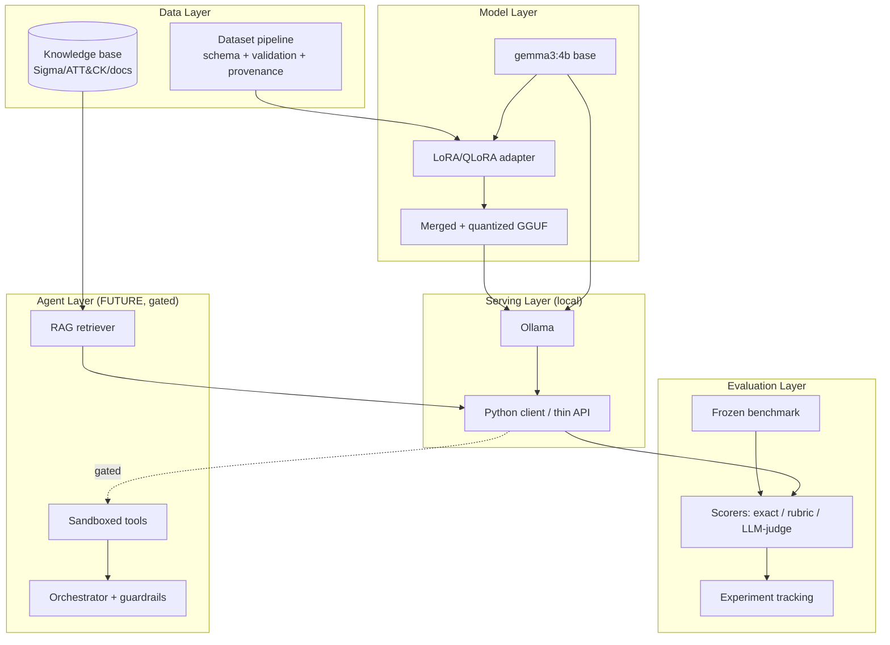
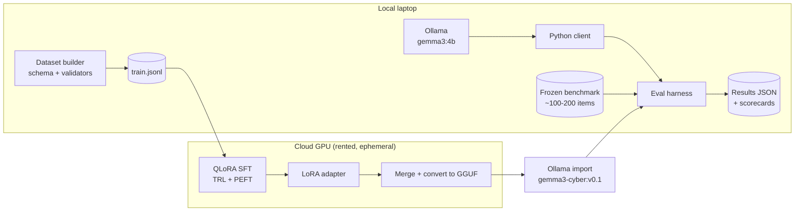
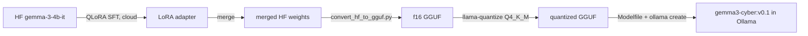
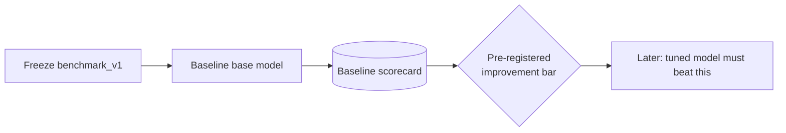
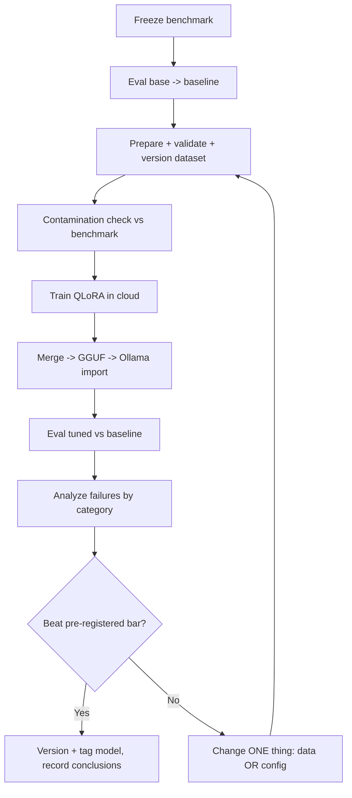
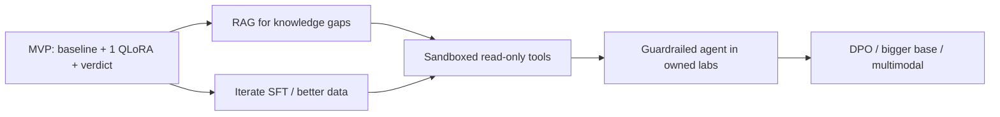

# PROJECT_PLAN.md — Gemma4-CyberAi

> A cybersecurity-specialized language model built on Google's open-weight `gemma3:4b`, served locally via Ollama, and specialized for **defensive security, CTF/HTB/THM-style reasoning, and authorized red-team education**.
>
> **Status:** Milestone 1 complete (2026-08-23) — Ollama client + frozen `benchmark_v1` (25 items) + baseline harness. Baseline recorded for `gemma3:4b`: pass_rate 0.84 / mean_score 0.813; standout weakness = hallucination resistance (0.0). No fine-tuning yet. See `docs/decisions.md` and `experiments/baseline_gemma3-4b/`.
> **Author context:** Solo developer, single laptop-class dev machine (see §20).
> **Document purpose:** Technical roadmap that another engineer (or a future session) can execute without re-deriving decisions.
> **Last updated:** 2026-08-23

---

## 0. How to read this document

This is a plan, not code. It is opinionated on purpose. Where I disagree with the original project framing, I say so (see §3, §13-labelled challenges, and §27). Every claim is tagged:

- **[FACT]** — verified against the local machine or current external documentation (sources in §5).
- **[REC]** — my recommendation as architect.
- **[ASSUMPTION]** — believed true but unverified; must be checked before it becomes load-bearing.
- **[OPEN]** — an unanswered question that blocks or shapes a decision (tracked in §27).

---

## Table of Contents

1. [Project Overview](#1-project-overview)
2. [Project Goals](#2-project-goals)
3. [Non-Goals](#3-non-goals)
4. [Current Repository Assessment](#4-current-repository-assessment)
5. [Confirmed Facts](#5-confirmed-facts)
6. [Assumptions](#6-assumptions)
7. [Open Questions](#7-open-questions)
8. [Proposed Architecture](#8-proposed-architecture)
9. [MVP Architecture](#9-mvp-architecture)
10. [Future Architecture](#10-future-architecture)
11. [Technology Stack](#11-technology-stack)
12. [Ollama Role](#12-ollama-role)
13. [Model Strategy](#13-model-strategy)
14. [Training Strategy](#14-training-strategy)
15. [Dataset Strategy](#15-dataset-strategy)
16. [Dataset Licensing and Provenance](#16-dataset-licensing-and-provenance)
17. [Evaluation Strategy](#17-evaluation-strategy)
18. [Baseline Evaluation](#18-baseline-evaluation)
19. [Experiment Methodology](#19-experiment-methodology)
20. [Hardware Requirements](#20-hardware-requirements)
21. [Repository Structure](#21-repository-structure)
22. [Development Phases](#22-development-phases)
23. [Initial Implementation Steps](#23-initial-implementation-steps)
24. [Cybersecurity Safety Model](#24-cybersecurity-safety-model)
25. [Limitations](#25-limitations)
26. [Risk Register](#26-risk-register)
27. [Research Questions](#27-research-questions)
28. [Prioritized Backlog](#28-prioritized-backlog)
29. [Definition of Done](#29-definition-of-done)
30. [Future Roadmap](#30-future-roadmap)

---

## 1. Project Overview

Gemma4-CyberAi specializes a small (4B-parameter) open-weight model for cybersecurity work. The thesis is narrow and testable:

> **Can we measurably improve `gemma3:4b` on a carefully designed, contamination-free cybersecurity benchmark — via prompting, RAG, and/or lightweight fine-tuning — enough to justify continued investment?**

Everything else (agents, tool use, autonomous lab-solving) is downstream of proving that thesis. The project is deliberately staged so that the **first deliverable is a measurement**, not a model.



---

## 2. Project Goals

- **G1** Establish a reproducible, contamination-free cybersecurity benchmark for a 4B model.
- **G2** Baseline `gemma3:4b` on that benchmark before any specialization.
- **G3** Determine the *cheapest intervention that works*: prompt → RAG → fine-tune, in that order of cost.
- **G4** Run one clean LoRA/QLoRA experiment and measure the delta vs. baseline.
- **G5** Build a dataset pipeline that teaches **evidence-based reasoning**, not answer memorization, with tracked provenance and licensing.
- **G6** Keep the whole thing serveable locally via Ollama for day-to-day use.
- **G7** Design (not yet build) a safe, sandboxed path toward tool-using agents in *authorized* environments only.

**Success for the MVP** = G1 + G2 + G4 completed, with a statistically-honest answer to the thesis question. A *negative* result (fine-tuning didn't help) is still a success of the process.

---

## 3. Non-Goals

Explicitly **out of scope** for the MVP, and in several cases for the whole project as currently resourced:

- ❌ An autonomous agent that attacks arbitrary external targets. (Never — see §24.)
- ❌ Training a model that outputs working exploits against real, non-consented systems.
- ❌ Local fine-tuning on the current dev machine — **not feasible** (no CUDA GPU; see §20).
- ❌ Continued pretraining / domain-adaptive pretraining in the MVP (too expensive for the expected payoff at 4B).
- ❌ RLHF/DPO/preference optimization in the MVP.
- ❌ A production API or polished UI in the MVP.
- ❌ A vector DB / RAG stack *before* the base model is baselined.
- ❌ Multimodal (image) cybersecurity tasks in the MVP, despite Gemma 3 being multimodal.
- ❌ Scraping HTB/THM content for training (see §16 — likely prohibited).

---

## 4. Current Repository Assessment

**[FACT]** The repository is **empty**. There is no source code, documentation, configuration, dependency manifest, Docker config, test, CI/CD, dataset, training code, or evaluation code. It is not even an initialized git repository.

```
/home/ghost/Github/Gemma4-CyberAi/
└── (empty — this PROJECT_PLAN.md is the first file)
```

| Aspect | State | Note |
|---|---|---|
| Source code | None | Greenfield |
| Docs | None (this file is first) | — |
| Dependencies / `pyproject.toml` | None | `uv` available on machine |
| Tests / CI | None | — |
| Docker | None | — |
| Ollama config | Ollama **installed** (v0.32.15), `gemma3:4b` + `qwen2.5-coder:7b` **already pulled** | Not repo-tracked; it's system state |
| Datasets | None | — |
| Git | **Not initialized** | First action item (P0) |

**Implications:**
- ✅ No technical debt, no legacy conflicts, no existing architecture to preserve. Full design freedom.
- ⚠️ Everything must be built. Nothing to "incorporate."
- ⚠️ No git means no history/rollback safety yet — initializing git is a P0 action.
- ✅ The naming (`Gemma4-CyberAi`) suggests you may have anticipated Gemma 4. Relevant: **Gemma 4 now exists** (Aug 2026). See §13 for whether to switch.

There is nothing to delete and nothing to break. This plan is the substrate for the repository.

---

## 5. Confirmed Facts

### 5.1 Local machine (verified via `lscpu`, `free`, `df`, `lspci`, `nvidia-smi`, `ollama`)

| Component | Value | Consequence |
|---|---|---|
| **[FACT]** CPU | Intel Core Ultra 5 235U (Arrow Lake-U), 12 cores / 14 threads | Fine for inference & data work; weak for training |
| **[FACT]** RAM | **15 GiB total** (~9 GiB available at probe) | **Hard constraint.** Limits even CPU experimentation |
| **[FACT]** GPU | Intel Arrow Lake-U **integrated graphics only** | **No CUDA, no ROCm.** `nvidia-smi` absent; no discrete GPU |
| **[FACT]** Disk | 236 GB total, **194 GB free**, LUKS-encrypted | Adequate for models + datasets |
| **[FACT]** OS | Fedora Linux 43, kernel 7.1.8 | Modern; fine |
| **[FACT]** Python | 3.14.7 system | **Too new** for the ML stack (see §6/§11) — pin an older venv |
| **[FACT]** Package mgr | `uv` installed; no conda | Use `uv` for env management |
| **[FACT]** Ollama | v0.32.15, working | `gemma3:4b` inference verified (runs on CPU) |
| **[FACT]** Models pulled | `gemma3:4b` (3.3 GB), `qwen2.5-coder:7b` (4.7 GB) | Both usable immediately for baselining |

> **The single most important fact in this document:** the dev machine has **no CUDA-capable GPU and 15 GiB RAM**. QLoRA/bitsandbytes require CUDA. **Fine-tuning cannot happen on this machine.** Training must run in the cloud (§20 Profile D). The laptop is an *inference + dataset + evaluation* box.

### 5.2 Gemma 3 4B (verified via Google model card, HF, Ollama library)

- **[FACT]** 4B parameters; trained on ~4T tokens.
- **[FACT]** **128K context window**; hybrid local/global attention (5:1 interleave) to bound KV-cache.
- **[FACT]** **Multimodal** (text + image in, text out) via a SigLIP vision encoder; supports 140+ languages.
- **[FACT]** Instruction-tuned variant: `google/gemma-3-4b-it` on Hugging Face; `gemma3:4b` on Ollama (a quantized GGUF, ~3.3 GB → roughly Q4-class).
- Sources: [Gemma 3 model card](https://ai.google.dev/gemma/docs/core/model_card_3), [google/gemma-3-4b-it](https://huggingface.co/google/gemma-3-4b-it), [ollama.com/library/gemma3:4b](https://ollama.com/library/gemma3:4b), [Gemma 3 4B specs/VRAM](https://apxml.com/models/gemma-3-4b).

### 5.3 Fine-tuning stack (verified)

- **[FACT]** Gemma 3 4B is fine-tunable with the standard HF stack: `transformers` + `peft` + `trl` (`SFTTrainer`) + `bitsandbytes` + `datasets`, and via **Unsloth** (2–5× faster, less memory). Sources: [Unsloth guide](https://learnopencv.com/unsloth-guide-efficient-llm-fine-tuning/), [Gemma-3-4B Unsloth repo](https://github.com/kumarpriyanshu09/Gemma-3-4B-Fine-tuning-with-Unsloth).
- **[FACT]** QLoRA loads the base in 4-bit NF4 via `bitsandbytes`, which **requires CUDA kernels**. A 4B QLoRA fits comfortably in **8–16 GB VRAM**; 16 GB gives batch/seq-length headroom. Sources: [Spheron VRAM guide 2026](https://www.spheron.network/blog/gpu-vram-requirements-fine-tune-llm-2026/), [QLoRA/bitsandbytes guide](https://alain-airom.medium.com/run-big-llms-on-small-gpus-a-hands-on-guide-to-4-bit-quantization-and-qlora-40e9e2c95054).
- One anecdotal report: Gemma 3 4B SFT ≈ ~1 h on a single GPU for a small run ([source](https://gemma4-ai.com/blog/gemma4-fine-tuning)) — **treat as illustrative, not a guarantee** (depends on data size, seq len, GPU).

### 5.4 Licensing (verified — see §16 for the full treatment)

- **[FACT]** Gemma is **not** OSI-open-source. It ships under the **custom [Gemma Terms of Use](https://ai.google.dev/gemma/terms)** with a flow-down **Prohibited Use Policy**. Commercial use is allowed *with restrictions*.
- **[FACT]** **Fine-tuning does not change the license**: every derivative checkpoint remains "a Gemma" and inherits the Terms + Prohibited Use Policy. Distributing a derivative requires passing those restrictions downstream. Sources: [Gemma Terms](https://ai.google.dev/gemma/terms), [WCR.LEGAL analysis](https://wcr.legal/google-gemma-license-risks/), [TechCrunch on "open" licenses](https://techcrunch.com/2025/03/14/open-ai-model-licenses-often-carry-concerning-restrictions/).

### 5.5 Gemma 4 exists

- **[FACT]** As of Aug 2026, **Gemma 4** is published (Google AI docs + `ollama.com/library/gemma4`). At least some reporting indicates a more permissive (Apache-2.0-style) license for Gemma 4 ([unverified detail — [source](https://www.mindstudio.ai/blog/gemma-4-apache-2-license-commercial-use)]). This is a **decision point**, not a settled fact — see §7-Q1 and §13.

---

## 6. Assumptions

- **[ASSUMPTION]** The ML training stack (PyTorch, `transformers`, `bitsandbytes`, Unsloth) does **not** yet fully support **Python 3.14** at the versions we need. → *Mitigation:* use a pinned **Python 3.11 or 3.12** venv (`uv venv --python 3.12`) for all ML work; keep system 3.14 untouched. **Verify at Phase 0.**
- **[ASSUMPTION]** Ollama's `gemma3:4b` is a ~Q4 GGUF quantization; scores will be *slightly below* the full-precision HF model. Baselines must record the exact quant used.
- **[ASSUMPTION]** A 4B model can reach *useful-but-not-expert* performance on **defensive reasoning and CTF *methodology*** questions, but will be weak at **multi-step exploitation execution**. (Tested in §18/§27.)
- **[ASSUMPTION]** You (the user) have or can obtain a cloud GPU budget (Colab/Kaggle free tier, or paid RunPod/Modal/Lambda). Without it, the project stops at prompting + RAG.
- **[ASSUMPTION]** You accept the Gemma Terms of Use and will comply with the Prohibited Use Policy for any derivative you create or distribute.

---

## 7. Open Questions

Ranked; full treatment with test/decision in §27.

| # | Question | Priority |
|---|---|---|
| Q1 | Start from `gemma3:4b` or switch to **Gemma 4** (newer, possibly more permissive license)? | **Critical** |
| Q2 | Do you have a cloud GPU budget, and how much? Determines whether fine-tuning is even on the table. | **Critical** |
| Q3 | Is the goal **personal/educational** or eventual **distribution/commercial**? Changes licensing obligations and data sourcing. | **Critical** |
| Q4 | Can a 4B model clear a *minimum useful bar* on the benchmark at all, even with best prompting? (If not, no amount of fine-tuning saves it.) | **High** |
| Q5 | What is the target task mix — mostly **blue-team analysis** (plays to 4B strengths) or **CTF solving** (plays to weaknesses)? | **High** |
| Q6 | Where does authoritative, license-clean cybersecurity training data come from? | **High** |

---

## 8. Proposed Architecture

Two views: the **conceptual** system (full ambition) and the **staged** build. We build strictly left-to-right; each stage must earn the next.



**Design principles:**
1. **Measurement precedes modeling.** The benchmark + baseline exist before any training.
2. **Cheapest intervention first.** Prompt → RAG → fine-tune.
3. **Training and inference are different stacks** (§12): train with HF/PEFT in the cloud; serve with Ollama locally.
4. **Every component must be justified by a failed experiment**, not by fashion.

---

## 9. MVP Architecture

Intentionally tiny. Only what's needed to answer the thesis.



**MVP components (and *only* these):**

| Component | In MVP? | Why |
|---|---|---|
| Ollama serving base + tuned model | ✅ | Your chosen local runtime; needed to run both models through the same harness |
| Python client to Ollama | ✅ | Deterministic, scriptable eval calls |
| Frozen benchmark (100–200 items) | ✅ | The measurement instrument; the whole point |
| Eval harness + scorers | ✅ | Turns model outputs into numbers |
| Dataset schema + validators | ✅ | Prevents garbage-in; enforces licensing/provenance |
| Small SFT dataset (few hundred–few thousand rows) | ✅ | Input to the one fine-tune experiment |
| Cloud QLoRA training job | ✅ | Only place training can happen |
| GGUF conversion + Ollama import | ✅ | Get the tuned model back into the local runtime |
| Experiment log (even a CSV/markdown) | ✅ | Reproducibility & comparison |
| RAG / vector DB | ❌ | Deferred to Phase 6 — prove the model first |
| Agents / tools | ❌ | Deferred to Phase 7, gated on results |
| API server / UI | ❌ | Not needed to answer the thesis |

---

## 10. Future Architecture

Added **only** when an experiment shows it's needed:

- **RAG + vector DB** (Phase 6): when the failure analysis shows errors are *knowledge gaps* (stale CVEs, tool flags, ATT&CK details) rather than *reasoning gaps*. RAG fixes knowledge; fine-tuning fixes behavior/format/reasoning style. Candidate stack: a small embedding model + `chromadb`/`qdrant`/`lancedb` (local), curated license-clean corpus.
- **Tool-calling** (Phase 7): structured function-calling for read-only recon parsers first (e.g., parse an nmap XML the user provides), never live scanning in early phases.
- **Agent/orchestrator** (Phase 7+): ReAct-style loop with **hard guardrails** (§24) — target allowlist, sandboxed execution, human approval, audit log, kill switch.
- **Sandboxed lab environment** (Phase 7+): disposable Docker/VM CTF targets you own; never external.
- **Model registry / experiment tracking** (as it grows): start with files, graduate to MLflow/W&B only if the experiment count justifies it.
- **Preference optimization (DPO)** (Phase 8): only if SFT plateaus and you have quality preference pairs.
- **Continued pretraining** (Phase 8, probably never at 4B solo): domain-adaptive pretraining is expensive and rarely worth it for a 4B at this scale.

---

## 11. Technology Stack

| Layer | Choice | Rationale | Alternatives |
|---|---|---|---|
| Local runtime | **Ollama** (installed) | User's requirement; simple GGUF serving + API | llama.cpp direct, LM Studio, vLLM (needs GPU) |
| Python env | **`uv` venv, Python 3.11/3.12** | `uv` present; **avoid system 3.14** (stack lag) | conda |
| Eval/client code | **Python 3.11/3.12**, `requests`/`ollama` pkg, `pydantic` | Schema validation + typed configs | plain dict + jsonschema |
| Dataset | **JSONL**, `datasets`, `pydantic` validators | Standard for TRL; easy to diff/version | Parquet |
| Training (cloud) | **`transformers` + `peft` + `trl` + `bitsandbytes` + `accelerate`**, optionally **Unsloth** | Verified Gemma 3 support; QLoRA fits 8–16 GB | axolotl, LLaMA-Factory |
| Quantization/convert | **llama.cpp `convert_hf_to_gguf.py` + `llama-quantize`** | Path from HF adapter → GGUF → Ollama | Ollama's own import of safetensors (verify support) |
| Experiment tracking | **Files first** (JSON + markdown log); W&B/MLflow later | Avoid premature infra | — |
| Versioning | **git** + tags; large files via git-lfs or external storage | Reproducibility | DVC (later) |
| Containers | **Docker** for the eventual sandbox only | Not needed in MVP | Podman (Fedora default) |

> **[REC]** Do **not** add LangChain/vector DBs/agents to `pyproject.toml` now. Add dependencies only when a phase needs them.

---

## 12. Ollama Role

**The distinction that must never blur:**

| | Training | Inference / Deployment |
|---|---|---|
| **Tool** | HF `transformers`+`peft`+`trl`+`bitsandbytes` (Unsloth optional), on a **CUDA GPU (cloud)** | **Ollama**, locally |
| **Why** | Ollama **cannot fine-tune**. It is a serving/inference runtime (GGUF + llama.cpp). It has no training loop, no autograd, no LoRA trainer. | Ollama gives you a clean local API, model packaging (`Modelfile`), and easy switching between base and tuned models. |
| **Artifact** | Produces a LoRA adapter → merged weights → GGUF | Consumes the GGUF |

**Ollama's concrete jobs in this project:**
1. **Download & run the base** `gemma3:4b` locally (done).
2. **Serve both** base and tuned models behind `http://localhost:11434` so the eval harness hits them identically.
3. **Package** the tuned model via a `Modelfile` (system prompt, params, template) → `ollama create gemma3-cyber:v0.1 -f Modelfile`.
4. **Version** local models by tag (`:v0.1`, `:v0.2`).
5. Provide the **development chat loop** for manual inspection.

**What Ollama is NOT for:** fine-tuning, LoRA, gradient anything. **[REC]** Never try to "train in Ollama." Do not let convenience drive that mistake.

**The round trip:**

**[OPEN]** Verify whether current Ollama can import a Gemma-3 safetensors/adapter directly vs. requiring the llama.cpp GGUF path — test in Phase 4.

---

## 13. Model Strategy

### 13.1 Is `gemma3:4b` the right starting model? (Challenging the assumption)

**[REC] Yes for the MVP — with eyes open, and after checking Gemma 4.**

Pros: small enough to serve on your laptop CPU; 128K context (great for log analysis); strong multilingual; already pulled; well-supported fine-tuning path.

Cons / honest caveats:
- 4B is **small**. It will *reason* about security at a junior level and **hallucinate specifics** (CVE numbers, exact tool flags, exploit chains). This is intrinsic, not a data problem.
- For hard **CTF/HTB exploitation**, a 4B is unlikely to compete with larger models even after tuning. Its realistic sweet spot is **structured blue-team analysis, triage, explanation, and methodology** — not novel exploit synthesis.

**[REC] Alternatives worth a bake-off in Phase 1:**
- **Gemma 4** (now available) — newer, possibly more permissive license (Q1). If a comparable small Gemma 4 exists and licensing is cleaner, **prefer it** and keep the repo name honest. Baseline it alongside gemma3:4b.
- **`qwen2.5-coder:7b`** (already pulled) — 7B, code-strong; useful as an *upper-reference* baseline to see how much size buys on your tasks. Not the target, but a cheap comparison.

**[REC]** Keep `gemma3:4b` as the primary subject for continuity, but **baseline 2–3 models in Phase 1** so you know whether your ceiling is the *model* or the *specialization*.

### 13.2 Capability classification (what to solve with what)

| Capability | Best solved by | Reasoning |
|---|---|---|
| Security concept explanation, definitions | **Prompting** (base already decent) | In-weights already; needs format, not knowledge |
| Consistent output format (triage template, report skeleton) | **Fine-tuning (SFT)** | Behavior/style shaping is what SFT is best at |
| Evidence-based reasoning style (§13-reasoning) | **Fine-tuning (SFT)** | Teach the *process*, not facts |
| Current CVEs, exact tool flags, ATT&CK IDs, Sigma fields | **RAG** | Volatile/precise facts; do not bake into 4B weights |
| Log/alert triage on provided evidence | **Prompting + light SFT** | Plays to context window + reasoning |
| Running tools (nmap, parsing pcaps live) | **External tools / agent** | Not a language task |
| Multi-step live exploitation | **Agent + tools + larger model** | Beyond 4B weights; needs execution loop |
| Novel exploit development | **Likely a larger model; possibly out of scope** | 4B ceiling; also safety-gated |
| "Insufficient evidence" honesty | **Fine-tuning (SFT) + eval pressure** | Must be explicitly taught & measured |

**MVP focuses on rows solvable by prompting + SFT.** RAG and agents are deferred by design.

### 13.3 Progression order (do not skip)

1. **Prompt baseline** — measure base + a good system prompt. *Free.*
2. **RAG baseline** — *only if* Phase-2 failures are knowledge-shaped. (May be deferred.)
3. **SFT via LoRA/QLoRA** — the MVP experiment.
4. **Continued pretraining** — likely never (cost vs. payoff at 4B).
5. **Preference optimization (DPO)** — only if SFT plateaus with good preference data.
6. **Tool-augmented** — Phase 7.
7. **Agentic** — Phase 7+, gated.

**Is fine-tuning even necessary? [REC]** Unknown until §18 baseline + §27-Q4. If a strong system prompt already clears your bar, fine-tuning may be unnecessary or only worth it for *format/reasoning consistency*. Don't assume SFT is the answer.

---

## 14. Training Strategy

> Applies to the **cloud** environment (Profile D, §20). Not runnable on the dev laptop.

### 14.1 Method

- **[REC]** Start with **QLoRA** (4-bit NF4 base + LoRA adapters). Smallest footprint, fits a single ≤16 GB GPU, cheapest cloud tier. Move to plain LoRA (bf16 base) only if you have ≥24 GB and want a quality check.
- Framework: **TRL `SFTTrainer`** + **PEFT** + **bitsandbytes**, optionally **Unsloth** for speed/memory. Use the **chat template** that matches Gemma 3 (apply `tokenizer.apply_chat_template`; do not hand-roll turn markers).

### 14.2 Parameters — *starting ranges, not gospel*

| Param | Starting range | What it affects | Tune when… |
|---|---|---|---|
| LoRA rank `r` | 8–32 (start 16) | Adapter capacity | Underfit → raise; overfit/slow → lower |
| LoRA `alpha` | ~2×`r` (16–64) | Effective LR of adapter | Pair with `r` |
| LoRA dropout | 0.0–0.1 | Regularization | Overfitting → raise |
| Target modules | attn + MLP proj (`q,k,v,o,gate,up,down`) | Coverage | Weak effect → add MLP |
| LR | 1e-4 – 2e-4 (QLoRA) | Convergence/stability | Loss NaN/spike → lower; flat → raise |
| Scheduler | cosine + warmup 3–5% | Stability | — |
| Epochs | 1–3 | Fit vs. overfit | Val loss ↑ while train ↓ → too many |
| Effective batch | 16–32 via grad-accum | Gradient noise | OOM → smaller micro-batch, more accum |
| Micro-batch | 1–4 | VRAM | OOM → lower |
| Max seq len | 1024–2048 (start), longer costs VRAM | Truncation vs. memory | Truncated evidence → raise |
| Weight decay | 0.0–0.1 | Regularization | — |
| Precision | bf16 compute, 4-bit base (QLoRA) | Speed/memory | — |

### 14.3 Reproducibility & checkpointing

- Fix and record all seeds; log exact package versions (`uv pip freeze`), commit hash, dataset version/hash, GPU type.
- Checkpoint every N steps; keep best-by-val-loss + last. Store adapters (small) in repo/LFS; store merged GGUF externally (large).
- Always hold out a **validation split** and run **held-out eval during training** — but the *benchmark* (§18) stays completely separate and unseen.

### 14.4 Bad-config symptoms

- Loss NaN/→inf: LR too high, or bf16/quant misconfig.
- Train loss ↓ but eval ↓ then ↑: overfitting → fewer epochs / more data / more dropout.
- No change vs. base: LR too low, wrong target modules, or template mismatch (very common — verify the chat template first).
- Model "forgets" general ability: catastrophic forgetting → lower LR/epochs, mix in some general data, smaller `r`.

---

## 15. Dataset Strategy

The dataset is the product. Its job: **teach reasoning and format**, not memorize answers.

### 15.1 Canonical example schema (§12-of-instructions)

```jsonc
{
  "id": "blue-log-0001",                 // stable unique id
  "schema_version": "1.0",
  "task_type": "log_triage",             // controlled vocabulary
  "domain": "blue_team",                 // blue_team | ctf | web | linux | windows | ad | network | ...
  "difficulty": "intermediate",          // intro | intermediate | advanced
  "context": "…system/role framing…",
  "evidence": "…logs / alert / pcap summary / code snippet…",
  "question": "What is happening and what do you do next?",
  "expected_approach": ["observe X", "hypothesize Y", "check Z", "reject W"],
  "tool_availability": ["grep", "zeek"],  // what the model may assume it can use
  "tool_output": null,                    // optional injected tool result for multi-turn
  "final_answer": "…grounded conclusion…",
  "remediation": "…if applicable…",
  "attack_mapping": ["T1110"],            // MITRE ATT&CK technique IDs
  "safety": {"authorization": "lab_only", "offensive": false},
  "source": "original|public_dataset_name",
  "provenance": "how/when created or obtained",
  "license": "CC-BY-4.0|original|…",
  "dataset_version": "0.1.0"
}
```

**Which fields become the *training text* vs. stay metadata:**

| Field | In training text? | Why |
|---|---|---|
| context, evidence, question | **Yes** (user turn) | The prompt the model learns to answer |
| expected_approach, final_answer, remediation | **Yes** (assistant turn) | The target behavior/reasoning |
| tool_output (if present) | **Yes** (as a turn) | Teaches interpretation |
| attack_mapping | **Sometimes** | Include in answer *only* when the task calls for it, else metadata |
| id, source, provenance, license, versions, safety, difficulty, domain, task_type | **No — metadata** | For filtering, dedup, audit, contamination checks, curriculum |

**[REC]** Render training text with the Gemma chat template. Keep the full JSON as the source of truth; generate the text at build time so you can re-render if the template changes.

### 15.2 Categories (target coverage)

- **Defensive:** log analysis, alert triage, incident response, IOC analysis, network/pcap reasoning, SIEM queries, detection engineering (Sigma), YARA reasoning, ATT&CK mapping, auth-event analysis, endpoint, vuln analysis, hardening, security architecture, IR report writing.
- **Authorized offensive / CTF:** recon, enumeration reasoning, web (OWASP-style), Linux/Windows/AD concepts, network security, privilege-escalation *reasoning*, exploit *analysis* (understanding, not weaponization), post-exploitation *concepts*, CTF methodology, tool-usage explanation, attack-path reasoning.

### 15.3 Sourcing (see §16 for legal detail)

- **Original authored examples** (highest value, cleanest license) — you write them, ideally from your own lab work.
- **License-clean public corpora**: MITRE ATT&CK (check terms), Sigma & YARA rule repos (their licenses), public CVE/NVD data, vendor security blogs *with permission or fair-use summaries you rewrite*, permissively-licensed datasets on HF (record each license).
- **Synthetic generation** with a stronger model to draft candidates, then **human review** — but beware self-training artifacts and license of the generator's output.
- **Your own CTF/lab writeups** (you own them).

### 15.4 Volume & quality

- **[REC]** Quality ≫ quantity at 4B. Start **small (a few hundred to ~2–3k high-quality rows)** for the first experiment. A tiny, clean, reasoning-rich set beats a large noisy scrape.
- Dedup (hash + near-dup), validate against schema, balance across domains/difficulty, and **check every row against the benchmark** to prevent contamination (§18).

---

## 16. Dataset Licensing and Provenance

> **This section can sink the project legally. Treat it as a gate, not a footnote.** I am an engineer, not a lawyer — where status is unclear this is flagged **[OPEN — legal review]**, not asserted.

### 16.1 HTB / TryHackMe content — **do not scrape**

- **[REC / caution]** HTB and THM walkthroughs, machine solutions, flags, questions, and paid course material are **copyrighted and governed by their Terms of Service**, which typically **prohibit redistribution and scraping**. Using them as training data is **very likely a ToS/copyright violation**, and flags/answers would also **contaminate** any benchmark.
- **[OPEN — legal review]** Exact permissions vary by account tier and change over time. **Do not assume** anything is usable. If in doubt, exclude.
- **What you *can* do:** learn methodology from them, then **author original examples in your own words** that teach the same *reasoning patterns* using **your own lab environments** (machines you own/deploy). Original writeups you author from your own consented labs are yours.

### 16.2 Gemma license flows into your dataset-trained model

- **[FACT]** Your fine-tuned model **remains "a Gemma"** under the [Gemma Terms of Use](https://ai.google.dev/gemma/terms) + **Prohibited Use Policy**, regardless of your data. If you distribute it, you must pass those restrictions downstream.

### 16.3 Provenance discipline (mandatory from row #1)

Every example carries `source`, `provenance`, `license`, `dataset_version`. Maintain a top-level `DATA_LICENSES.md` mapping each source → license → permitted use. Build a validator that **rejects any row lacking a license**. Keep a "quarantine" for anything of uncertain status; never let quarantine into `train/`.

### 16.4 Contamination control

- Maintain the benchmark (§18) in a **separate, access-controlled path** (`data/evaluation/`), and run an automated **overlap check** (exact + fuzzy) of every training row against every benchmark item before each training run. Fail the build on any hit.

### 16.5 Checklist

- [ ] `DATA_LICENSES.md` created and kept current.
- [ ] Schema requires `license` + `provenance`; validator enforces it.
- [ ] No HTB/THM scraped content in `data/`.
- [ ] Benchmark isolated; contamination check runs pre-train and passes.
- [ ] **[OPEN]** Legal review completed if the model will be distributed or used commercially (Q3).

---

## 17. Evaluation Strategy

Loss is **not** success. We measure task behavior on a frozen benchmark.

### 17.1 Categories (mapped to metrics)

| Category | Metric type |
|---|---|
| Cyber fundamentals (MCQ) | Accuracy / exact match |
| Blue-team analysis, IR, log analysis | Rubric score (0–3) or LLM-judge vs. reference |
| Threat detection, Sigma/YARA reasoning | Rubric + key-element recall |
| Vulnerability identification | Correct-vuln accuracy; false-positive rate |
| Network / web / Linux / Windows / AD reasoning | Rubric / MCQ mix |
| CTF, enumeration, exploitation *reasoning* | Rubric (approach correctness), not live pwn |
| Remediation quality | Rubric |
| Tool selection | Accuracy vs. expected tool set |
| Evidence interpretation | Rubric: is the conclusion grounded in given evidence? |
| **Hallucination resistance** | Hallucination rate (fabricated CVEs/flags/facts) |
| **Insufficient-evidence recognition** | % correctly answering "insufficient evidence" on trap items |

### 17.2 Metrics defined

- **Accuracy / exact-match** for closed items (MCQ, tool selection).
- **Rubric score** (0–3) for open items, with a written rubric per item; scored by a **judge model** (a stronger model, or `qwen2.5-coder:7b` as a cheap local judge) **and spot-checked by you** for calibration.
- **Hallucination rate** = fraction of responses containing a fabricated specific (invented CVE/flag/command that doesn't exist). Requires trap items.
- **Groundedness** = does the conclusion follow from provided evidence only?
- **Regression rate** = % of items where the tuned model is *worse* than base (catches catastrophic forgetting).
- **Task completion / pass-fail** for items with a checkable answer.

### 17.3 Harness requirements

- Deterministic: fixed temperature (0 for scored runs), fixed seeds where possible, pinned model tag + quant recorded.
- Same harness hits base and tuned models via the identical Ollama API path.
- Output: per-item results + per-category aggregates + a diff vs. baseline, saved as JSON + a markdown scorecard.
- **[REC]** Build the judge with a rubric and a few-shot calibration set; validate judge–human agreement on ~20 items before trusting it.

---

## 18. Baseline Evaluation

**Mandatory and first.** No training happens before this exists.

- Freeze the benchmark (`data/evaluation/benchmark_v1.jsonl`), tag it in git, and **never** let it enter `data/training/`.
- Run the harness against **`gemma3:4b` (base)** and record every metric per category. Optionally also baseline **Gemma 4** and **qwen2.5-coder:7b** for reference ceilings.
- Store `experiments/baseline_gemma3-4b/results.json` + scorecard.
- Define, up front, the **minimum improvement worth pursuing** (e.g., "+X points on blue-team rubric and no category regression"). Without a pre-registered threshold, you'll rationalize noise as success.



**Leakage rules:** benchmark items are never generated by the same prompt/process that generates training data; run the automated overlap check (§16.4) before every training run.

---

## 19. Experiment Methodology

The loop (each turn produces one immutable experiment record):



### 19.1 What to log per experiment (immutable record)

`experiments/<exp-id>/manifest.json`:
- base model + exact tag/quant; **model version** produced
- **dataset version + hash + row count** + category distribution
- full training config + LoRA config + quantization
- hardware (GPU type), training duration, seeds, package freeze, git commit
- eval results (all metrics) + diff vs. baseline
- **known weaknesses** / failure themes from analysis
- conclusion: keep / discard / iterate

### 19.2 Naming convention

`exp-<NNN>-<subject>-<method>-<key-var>` → e.g. `exp-003-gemma3-4b-qlora-r16-blueteam2k`.
Model tags in Ollama: `gemma3-cyber:v0.<N>`. Dataset versions: SemVer `MAJOR.MINOR.PATCH`.

### 19.3 Discipline

Change **one variable at a time** (data *or* config, not both) so deltas are attributable. Keep every scorecard; never overwrite. A negative result is recorded, not deleted.

---

## 20. Hardware Requirements

> **Reality for this project:** the dev laptop **cannot fine-tune** (no CUDA GPU, 15 GiB RAM). It is an excellent *inference + dataset + evaluation* box. **Fine-tuning = cloud.** Profiles B/C describe machines you would *buy/rent*; D is the realistic path for you now.

### Profile A — Minimal development *(≈ your current laptop)*
- CPU: modern x86 (you have Intel Ultra 5 235U, 14 threads). GPU: none/iGPU. **RAM: 16 GB.** Disk: 100 GB+ free (you have 194 GB). OS: Linux.
- **Can do:** run `gemma3:4b` via Ollama (CPU) for inference & manual testing; build/validate datasets; run the eval harness (slowly); all Phase 0–3 work; import/serve tuned GGUFs.
- **Cannot do:** any GPU training; QLoRA/bitsandbytes; large-batch eval quickly.
- **[FACT]** This is your machine. 15 GiB RAM means keep other apps closed during eval; a single 4B GGUF + Ollama is fine, but headroom is thin.

### Profile B — Recommended local training (aspirational purchase)
- GPU: single NVIDIA with **16 GB VRAM** (e.g., 4060 Ti 16GB / 4070 Ti Super class). System RAM: 32 GB. CPU: 8-core+. Disk: 1 TB NVMe. CUDA + recent driver.
- **Can do:** comfortable **QLoRA of a 4B**; small LoRA; overnight runs.
- **Minimum** for serious local FT: **12 GB VRAM** (tighter batches/seq len). **Recommended: 16 GB. Comfortable: 24 GB.**

### Profile C — High-end local training
- GPU: **24 GB VRAM** (RTX 4090 / 3090). RAM: 64 GB. Fast NVMe 2 TB.
- **Can do:** LoRA in bf16, longer sequences, faster iteration, headroom for 7B experiments.

### Profile D — Cloud fallback **(your actual training path)**
- Rent a single GPU (≥16 GB): Google **Colab** / **Kaggle** free tiers (great for the first QLoRA), or paid **RunPod / Modal / Lambda / Vast** for reliability & longer runs.
- **Can do:** all training; ephemeral, pay-per-hour; pull dataset, run QLoRA, export adapter/GGUF, tear down.
- **[REC]** Start on a **free Colab/Kaggle T4/A10-class** GPU for `exp-001`. Budget only matters once experiments recur.
- **[REC]** Never store secrets/creds in notebooks; treat cloud as untrusted for sensitive lab data.

> **[REC]** No exact training-time promises. A single small 4B QLoRA run on a T4/A10 is typically on the order of tens of minutes to a few hours depending on rows and seq len — **measure it in `exp-001`**, don't trust a blog number.

---

## 21. Repository Structure

Adapted to a greenfield repo. **Start minimal;** create directories only as their phase arrives (annotated). Do not scaffold empty dirs for phases you haven't reached.

```text
Gemma4-CyberAi/
├── README.md                     # P0: what/why/how-to-run
├── PROJECT_PLAN.md               # this file
├── DATA_LICENSES.md              # P0: source→license map (§16)
├── pyproject.toml                # P0: uv-managed, py3.11/3.12, pinned
├── .gitignore                    # P0: ignore models/, data/raw large, .venv
├── configs/                      # P1: eval + (later) train YAML/JSON configs
├── data/
│   ├── raw/                      # P3: as-obtained sources (git-ignored if large)
│   ├── processed/                # P3: cleaned/normalized
│   ├── training/                 # P3: train/val JSONL (versioned)
│   └── evaluation/               # P2: FROZEN benchmark (isolated, tagged)
├── src/
│   ├── clients/                  # P1: Ollama client wrapper
│   ├── data/                     # P3: schema (pydantic), validators, builders
│   ├── evaluation/               # P2: harness, scorers, judge, scorecards
│   ├── training/                 # P4: cloud QLoRA scripts (run in cloud)
│   ├── inference/                # P4: GGUF convert + Modelfile tooling
│   ├── agents/                   # P7 ONLY: do not create yet
│   └── tools/                    # P7 ONLY: do not create yet
├── scripts/                      # thin CLI entrypoints (pull, baseline, train, eval)
├── tests/                        # P1+: schema tests, harness tests, scorer tests
├── experiments/                  # P2+: immutable per-experiment records
├── models/                       # git-ignored: local GGUFs/adapters
└── docs/                         # phase notes, decisions, runbooks
```

**Why each change:** `data/evaluation` is isolated for contamination control (§16/§18); `experiments/` gives immutable reproducibility (§19); `src/agents` & `src/tools` are explicitly **not** created until Phase 7 to resist over-engineering (§26); `models/` is git-ignored because GGUFs are large.

---

## 22. Development Phases

Each phase lists Objective / Prereqs / Tasks / Deliverables / Tests / Acceptance / Risks / Exit / **Do NOT build yet**.

### Phase 0 — Research & validation
- **Objective:** confirm feasibility and lock decisions Q1–Q3.
- **Prereqs:** none.
- **Tasks:** init git; set up `uv` venv (py3.11/3.12) and verify the ML stack *imports*; decide gemma3 vs gemma4 (Q1); confirm cloud GPU access (Q2); confirm project intent/licensing (Q3); read Gemma Terms + Prohibited Use Policy.
- **Deliverables:** `README.md`, `pyproject.toml`, `.gitignore`, `DATA_LICENSES.md`, decisions recorded in `docs/decisions.md`.
- **Tests:** `python -c "import torch, transformers, peft, trl"` succeeds in the venv (CPU build ok); `ollama run gemma3:4b` responds.
- **Acceptance:** Q1–Q3 answered; env reproducible.
- **Risks:** Python 3.14 stack incompatibility → use 3.11/3.12.
- **Exit:** decisions locked, repo bootstrapped.
- **Do NOT build yet:** datasets, training, agents.

### Phase 1 — Ollama baseline
- **Objective:** deterministic local inference through a Python client for 1–3 candidate models.
- **Tasks:** Ollama client wrapper (`src/clients`), temperature/seed control, a `scripts/chat.py` smoke test; baseline latency notes; optionally add gemma4 / qwen for comparison.
- **Deliverables:** working client; a handful of manual security prompts + responses saved in `docs/`.
- **Tests:** client returns deterministic output at temp 0; handles timeouts.
- **Acceptance:** can programmatically query base model(s) reproducibly.
- **Exit:** harness has something to call.
- **Do NOT build yet:** the benchmark scorers (next phase), any training.

### Phase 2 — Cybersecurity benchmark + baseline
- **Objective:** the measurement instrument (§17) + the mandatory baseline (§18).
- **Tasks:** author 100–200 benchmark items across categories (incl. hallucination traps + insufficient-evidence traps); write rubrics; build harness + scorers + judge; **freeze & tag** benchmark; run baseline; pre-register the improvement bar.
- **Deliverables:** `data/evaluation/benchmark_v1.jsonl`, harness, `experiments/baseline_*/`.
- **Tests:** judge–human agreement checked on ~20 items; harness reproducible.
- **Acceptance:** baseline scorecard exists; improvement threshold written down.
- **Risks:** small benchmark = noisy; author enough items per category to be meaningful.
- **Exit:** we know how good the base model is.
- **Do NOT build yet:** any fine-tuning.

### Phase 3 — Dataset pipeline
- **Objective:** clean, licensed, contamination-checked SFT data teaching reasoning (§13.2, §15).
- **Tasks:** pydantic schema + validators; provenance/license enforcement; contamination check vs benchmark; author/collect a few hundred–~2k high-quality rows; version the dataset.
- **Deliverables:** `data/training/train_v0.1.jsonl` (+val), `DATA_LICENSES.md` updated, validation report.
- **Tests:** schema validation passes; zero benchmark overlap; dedup clean.
- **Acceptance:** dataset versioned, licensed, contamination-free.
- **Risks:** licensing (§16), low quality → poor tuning.
- **Exit:** training input ready.
- **Do NOT build yet:** RAG, agents.

### Phase 4 — First LoRA/QLoRA experiment
- **Objective:** the smallest meaningful fine-tune (§14), in the cloud.
- **Tasks:** cloud QLoRA (TRL+PEFT); export adapter; merge; convert to GGUF; `ollama create gemma3-cyber:v0.1`; log full manifest.
- **Deliverables:** adapter, GGUF, `experiments/exp-001-*/manifest.json`.
- **Tests:** tuned model loads & responds in Ollama; training curves sane.
- **Acceptance:** a tuned model exists and is serveable locally.
- **Risks:** template mismatch (no effect), OOM, GGUF conversion friction (Q13/§12 OPEN).
- **Exit:** tuned model ready to evaluate.
- **Do NOT build yet:** a second experiment before evaluating the first.

### Phase 5 — Evaluation & iteration
- **Objective:** answer the thesis.
- **Tasks:** run tuned vs baseline on frozen benchmark; failure analysis by category; check for regression/forgetting; decide keep/iterate; if iterating, change **one** variable.
- **Deliverables:** comparison scorecard + written conclusion in `experiments/`.
- **Acceptance:** clear, honest verdict vs. the pre-registered bar.
- **Exit:** decision to iterate SFT, try RAG, try a bigger/newer model, or stop.
- **Do NOT build yet:** agents/tools regardless of outcome.

### Phase 6 — RAG / knowledge augmentation *(only if Phase 5 shows knowledge-shaped failures)*
- **Objective:** externalize volatile facts.
- **Tasks:** curate license-clean KB; embedding model + local vector DB; retrieval-augmented eval; compare vs. SFT-only.
- **Acceptance:** RAG measurably fixes the knowledge-gap categories without hurting others.
- **Do NOT build yet:** live tools.

### Phase 7 — Controlled cybersecurity agent *(gated on demonstrated model usefulness)*
- **Objective:** tool use in **sandboxed, authorized** environments only (§24).
- **Tasks:** read-only parsers first; then guarded execution (allowlist, sandbox, human approval, audit, kill switch); disposable owned lab targets.
- **Acceptance:** agent operates only within the sandbox; every safety control tested; no path to external targets.
- **Do NOT build:** anything that can act on non-consented systems.

### Phase 8 — Advanced specialization *(future)*
- DPO if justified; larger/newer base; multimodal security tasks; broader benchmark. Future work.

---

## 23. Initial Implementation Steps

**First coding milestone = Phase 1 + start of Phase 2: a working Ollama client + the beginnings of the benchmark harness that reproduces a baseline number.** Rationale: it produces *measurable output* immediately, requires no GPU, forces the contamination/evaluation discipline early, and creates the instrument every later phase depends on. **We deliberately do NOT start fine-tuning.**

Concrete steps (run yourself; commands verified against your environment where possible):

```bash
# 0. Initialize repo + env (Phase 0)
cd /home/ghost/Github/Gemma4-CyberAi
git init
uv venv --python 3.12 .venv          # avoid system Python 3.14
source .venv/bin/activate
uv pip install requests pydantic ollama pytest pyyaml

# 1. Confirm the base model is serveable (already pulled; verified working)
ollama list                           # shows gemma3:4b, qwen2.5-coder:7b
ollama run gemma3:4b "In one sentence, what is lateral movement?"

# 2. (later, in cloud only) training deps — do NOT install locally for GPU use
#    transformers peft trl bitsandbytes accelerate datasets  (CUDA env)
```

Then, in code (Phase 1→2):
1. `src/clients/ollama_client.py` — thin wrapper over `http://localhost:11434/api/generate` (or the `ollama` pkg), temp 0, timeouts, records model tag.
2. `src/evaluation/schema.py` — pydantic model for benchmark items.
3. `data/evaluation/benchmark_v1.jsonl` — begin authoring items (start with 20 across 4 categories to exercise the harness, then grow to 100–200).
4. `src/evaluation/harness.py` + `src/evaluation/scorers.py` — run items, apply exact-match/rubric/judge, emit `experiments/baseline_gemma3-4b/results.json` + a markdown scorecard.
5. `scripts/run_baseline.py` — one command → baseline scorecard.

**Acceptance for the first milestone:** `python scripts/run_baseline.py` produces a per-category scorecard for `gemma3:4b` on the frozen benchmark, reproducibly.

---

## 24. Cybersecurity Safety Model

**Framing:** this project is for **education, CTFs, your own infrastructure, defensive security, and authorized testing only.** Unauthorized real-world exploitation is out of scope, full stop.

| Context | Stance |
|---|---|
| Security education / concepts | ✅ Core use |
| CTFs / your own labs | ✅ Core use |
| Your own infrastructure | ✅ |
| Authorized pentest (written scope) | ✅ with guardrails |
| Defensive/blue-team | ✅ Core use |
| Unauthorized exploitation of others' systems | ❌ Never; design forbids it |

**Guardrails for any future tool/agent (Phase 7+), all mandatory before execution features ship:**
- **Sandboxing** (containers/VMs; no host access) and **network isolation** (no route to the internet or non-lab hosts).
- **Target allowlist** — the agent can only act on explicitly enumerated, owned/consented IPs/hosts. Default deny.
- **Human-in-the-loop approval** for any state-changing or offensive action.
- **Command logging + immutable audit trail** of every tool invocation and output.
- **Tool restrictions & rate limits**; **credential isolation** (no real creds in the loop); **disposable environments** (rebuild per session).
- **Kill switch** that halts the agent and tears down the sandbox.
- Prompt-injection defense: treat **all tool output as untrusted** (§25) — never let retrieved/scanned content escalate the agent's authorization.

**[REC]** The MVP builds **none** of this. It's specified now so Phase 7 can't cut corners later. Early phases never touch a live target.

---

## 25. Limitations

Blunt, as requested — where this is likely to disappoint or fail:

- **4B capacity:** junior-analyst-level reasoning at best; it will not match large models on hard CTF/exploitation. This is structural.
- **Hallucination:** will invent CVE numbers, tool flags, exploit steps, and "flags." High-stakes specifics must come from RAG/tools, not weights.
- **Reasoning depth:** multi-step attack chains and long deductive proofs are unreliable at 4B.
- **Context vs. attention:** 128K context ≠ 128K *understanding*; long-log reasoning degrades.
- **Knowledge freshness:** frozen at training; new CVEs/techniques unknown → RAG territory.
- **Quantization:** Ollama Q4 GGUF loses some quality vs. full precision; baseline must record quant.
- **Dataset quality/bias:** small hand-authored data risks narrowness and your own blind spots; garbage in → confidently wrong out.
- **Catastrophic forgetting / overfitting:** SFT can degrade general ability or memorize your few examples. Measured via regression rate.
- **Evaluation is hard:** open-ended security answers are judgment calls; judge models are imperfect and can be gamed.
- **Tool/agent/exploit reliability (future):** brittle; misleading tool output; exploits rarely work first try; automation amplifies mistakes.
- **Hardware:** no local GPU + 15 GB RAM caps iteration speed and forces cloud for training.
- **Cost/time:** solo effort; benchmark + dataset authoring is the real time sink, not the training.
- **Licensing:** Gemma Terms flow down; HTB/THM content is off-limits for training.
- **Security of the system itself:** prompt injection via logs/tool output; malicious content in "evidence"; autonomous-action risk. Treat inputs as hostile.

**Honest bottom line:** the most *likely* good outcome is a model that's a better-formatted, more consistent **blue-team/CTF-methodology assistant** than the base — not an autonomous hacker. If your goal is the latter at 4B, expect disappointment; plan for the former.

---

## 26. Risk Register

Severity = Prob × Impact (H/M/L). Sorted by priority.

| ID | Risk | Prob | Impact | Sev | Early warning | Mitigation | Contingency |
|---|---|---|---|---|---|---|---|
| R1 | 4B too weak to clear a useful bar even with tuning | M-H | H | **High** | Baseline far below bar; SFT gains marginal | Focus on blue-team/methodology niche; baseline gemma4/7B for ceiling | Switch base model or reframe scope to assistant, not solver |
| R2 | Dataset licensing violation (HTB/THM/scrapes) | M | H | **High** | Unlicensed rows; scraped content | Enforce license field; forbid scraping; `DATA_LICENSES.md` | Purge tainted data; legal review (Q3) |
| R3 | Benchmark contamination inflates results | M | H | **High** | Suspiciously high tuned scores | Isolate benchmark; automated overlap check pre-train | Rebuild benchmark; re-run |
| R4 | No/insufficient cloud GPU access | M | H | **High** | Can't run exp-001 | Free Colab/Kaggle first; budget plan | Stop at prompt+RAG; skip FT |
| R5 | Fine-tuning yields no measurable gain | M | M | **Med** | Tuned ≈ base on benchmark | Verify chat template; fix data quality; try RAG | Accept negative result; pivot to RAG/prompting |
| R6 | Catastrophic forgetting / overfitting | M | M | **Med** | Regression rate up; repeats train answers | Fewer epochs, lower LR, more/mixed data | Roll back to prior adapter |
| R7 | Python 3.14 / stack incompatibility | M | M | **Med** | Import/build failures | Pin py3.11/3.12 venv | Use cloud env for all ML libs |
| R8 | GGUF conversion / Ollama import friction | M | M | **Med** | Tuned model won't import | Follow llama.cpp path; test early | Serve via HF/llama.cpp temporarily |
| R9 | Evaluation judge unreliable | M | M | **Med** | Judge disagrees with you | Calibrate judge–human on 20 items; rubrics | Manual scoring for key categories |
| R10 | Over-engineering (agents/RAG too early) | M | M | **Med** | Building tools before baseline | This plan's phase gates (§26 principle) | Freeze scope to MVP |
| R11 | Agent safety failure (future) | L (now) | H | **Med** | Any action outside sandbox | §24 guardrails, allowlist, kill switch | Disable agent; audit |
| R12 | Prompt injection via evidence/tool output | M | M | **Med** | Model follows embedded instructions | Treat inputs as untrusted; separate system prompt | Sanitize; sandbox |
| R13 | Solo-project scope/time overrun | H | M | **Med** | Phases slipping; nothing measured | Ship the baseline milestone first | Cut to MVP; drop later phases |

---

## 27. Research Questions

| ID | Question | Priority | Why it matters | How to test | Evidence needed | Decision it drives |
|---|---|---|---|---|---|---|
| Q1 | gemma3:4b vs Gemma 4 as base? | **Critical** | Newer model + possibly cleaner license | Baseline both on benchmark_v1 (Phase 2) | Scorecards + license read | Which base to specialize |
| Q2 | Cloud GPU budget/access? | **Critical** | Gates whether FT is possible | Confirm Colab/Kaggle/paid access | Access + $ ceiling | FT vs prompt/RAG-only |
| Q3 | Personal vs distributed/commercial? | **Critical** | Changes licensing/data obligations | User decision + legal read | Intent + Gemma/data terms | Data sourcing + distribution rules |
| Q4 | Can 4B clear a useful bar with best prompting? | **High** | If not, FT won't save it | Prompt baseline vs pre-registered bar | Baseline scorecard | Whether to fine-tune at all |
| Q5 | Task mix: blue-team vs CTF-heavy? | **High** | 4B strong at former, weak at latter | Per-category baseline breakdown | Category scores | Dataset & scope focus |
| Q6 | Where does clean training data come from? | **High** | Determines quality + legality | Inventory sources + licenses | `DATA_LICENSES.md` | Dataset feasibility |
| Q7 | Are failures knowledge- or reasoning-shaped? | **High** | Chooses RAG vs SFT | Failure analysis in Phase 5 | Categorized error log | Phase 6 go/no-go |
| Q8 | Does Q4 GGUF quant hurt materially? | **Med** | Affects deploy quality | Compare quant vs fp on subset | Scorecard delta | Which quant to ship |
| Q9 | Can current Ollama import Gemma-3 adapters directly? | **Med** | Simplifies §12 round trip | Attempt import in Phase 4 | Success/fail | Conversion pipeline |
| Q10 | Judge–human agreement good enough? | **Med** | Eval trustworthiness | 20-item calibration | Agreement rate | Trust judge vs manual |

---

## 28. Prioritized Backlog

### P0 — Blocking
| ID | Description | Reason | Deps | Acceptance |
|---|---|---|---|---|
| P0-1 | `git init` + `.gitignore` + `README` | No history/rollback yet | — | Repo tracked; models/ ignored |
| P0-2 | `uv` venv py3.11/3.12 + stack import check | Avoid 3.14 breakage | P0-1 | `import torch,transformers,peft,trl` ok |
| P0-3 | Answer Q1–Q3 (base, GPU budget, intent) | Gate all later work | — | Decisions in `docs/decisions.md` |
| P0-4 | `DATA_LICENSES.md` + license policy | Legal gate (§16) | P0-1 | File exists; policy written |

### P1 — Essential
| ID | Description | Reason | Deps | Acceptance |
|---|---|---|---|---|
| P1-1 | Ollama Python client (temp0, seeds) | Deterministic eval | P0-2 | Reproducible responses |
| P1-2 | Benchmark schema (pydantic) | Data integrity | P0-2 | Validates sample items |
| P1-3 | Author benchmark_v1 (100–200 items) | The instrument | P1-2 | Categories + traps covered |
| P1-4 | Eval harness + scorers + judge | Turn output→numbers | P1-1,P1-3 | Baseline scorecard emitted |
| P1-5 | Baseline gemma3:4b (+optional gemma4/qwen) | Mandatory baseline | P1-4 | `experiments/baseline_*` |
| P1-6 | Pre-register improvement bar | Prevents noise-chasing | P1-5 | Threshold documented |

### P2 — Important
| ID | Description | Reason | Deps | Acceptance |
|---|---|---|---|---|
| P2-1 | Dataset schema + validators + contamination check | Clean, safe data | P1-3 | Zero benchmark overlap enforced |
| P2-2 | Author train_v0.1 (few hundred–2k rows) | FT input | P2-1 | Versioned, licensed, validated |
| P2-3 | Cloud QLoRA script (TRL+PEFT) | The experiment | P0-3(Q2) | Runs in Colab/RunPod |
| P2-4 | GGUF convert + Ollama import tooling | Round trip | P2-3 | `gemma3-cyber:v0.1` runs |
| P2-5 | exp-001 eval vs baseline + conclusion | Answer thesis | P2-4,P1-5 | Comparison scorecard + verdict |

### P3 — Future
| ID | Description | Reason | Deps |
|---|---|---|---|
| P3-1 | RAG + vector DB | If knowledge-gap failures (Q7) | P2-5 |
| P3-2 | DPO / preference opt | If SFT plateaus | P2-5 |
| P3-3 | Sandboxed tool layer | Toward agent (§24) | P2-5 |
| P3-4 | Controlled agent + guardrails | Phase 7 | P3-3 |
| P3-5 | Experiment tracking (W&B/MLflow), model registry | When exp count grows | P2-5 |

---

## 29. Definition of Done

**MVP is done when all of the following hold:**
- [ ] Repo bootstrapped (git, venv, README, `DATA_LICENSES.md`).
- [ ] Q1–Q3 answered and recorded.
- [ ] `benchmark_v1` frozen, tagged, isolated; ≥100 items with traps for hallucination + insufficient-evidence.
- [ ] Baseline scorecard for `gemma3:4b` exists; improvement bar pre-registered.
- [ ] `train_v0.1` versioned, licensed, schema-valid, **zero benchmark overlap**.
- [ ] One QLoRA experiment completed in the cloud; tuned model imported into Ollama.
- [ ] Tuned vs. baseline comparison scorecard produced, with per-category failure analysis and regression check.
- [ ] A written, honest verdict on the thesis (positive **or** negative) in `experiments/`.
- [ ] Every experiment reproducible from its `manifest.json`.

**Not required for MVP done:** RAG, agents, tools, API, UI, multimodal, DPO.

---

## 30. Future Roadmap



- **Near term (post-MVP):** iterate dataset & SFT on weakest categories; add RAG *only if* Q7 says knowledge-shaped; expand benchmark.
- **Mid term:** read-only tool integration (parse user-provided nmap/pcap/logs); consider Gemma 4 or a 7–8B base for a capability jump if resources allow.
- **Long term (gated on proven usefulness + §24 guardrails):** controlled agent operating strictly in disposable, owned CTF labs; audit-logged, human-approved, network-isolated. Never against non-consented targets.
- **Speculative:** DPO for answer quality; multimodal security tasks (screenshots, diagrams); domain-adaptive pretraining (probably not worth it at 4B solo).

---

### Sources (external facts, §5)

- Gemma 3 model card — https://ai.google.dev/gemma/docs/core/model_card_3
- google/gemma-3-4b-it — https://huggingface.co/google/gemma-3-4b-it
- Ollama gemma3:4b — https://ollama.com/library/gemma3:4b
- Gemma 3 4B specs / VRAM — https://apxml.com/models/gemma-3-4b
- Gemma 4 overview — https://ai.google.dev/gemma/docs/core
- Unsloth fine-tuning guide — https://learnopencv.com/unsloth-guide-efficient-llm-fine-tuning/
- Gemma-3-4B Unsloth example — https://github.com/kumarpriyanshu09/Gemma-3-4B-Fine-tuning-with-Unsloth
- QLoRA VRAM sizing (2026) — https://www.spheron.network/blog/gpu-vram-requirements-fine-tune-llm-2026/
- QLoRA/bitsandbytes hands-on — https://alain-airom.medium.com/run-big-llms-on-small-gpus-a-hands-on-guide-to-4-bit-quantization-and-qlora-40e9e2c95054
- Gemma Terms of Use — https://ai.google.dev/gemma/terms
- Gemma license risk analysis — https://wcr.legal/google-gemma-license-risks/
- "Open" model license restrictions — https://techcrunch.com/2025/03/14/open-ai-model-licenses-often-carry-concerning-restrictions/

*End of PROJECT_PLAN.md*
